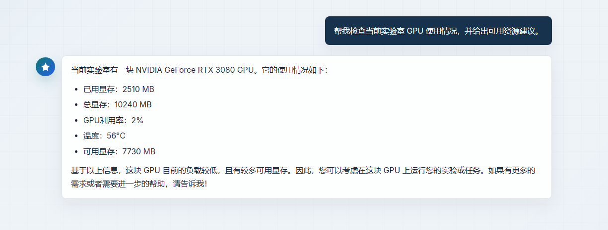
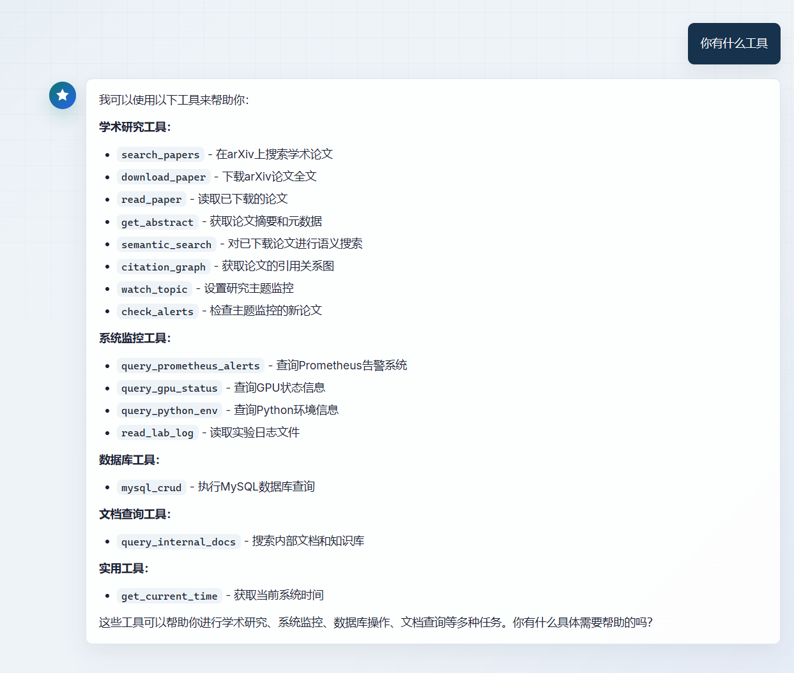

# 智能运维 Agent

这是一个面向实验室与业务运维场景的智能 Agent 项目，包含 Go 后端、原生 Web 前端、知识库索引、Milvus 向量检索以及若干本地运维工具。它可以进行普通/流式对话、上传文档构建知识库，并查询 GPU、Python 环境、日志、告警和内部文档等信息。

## 效果预览




## 功能特性

- 智能对话：支持普通对话接口和 SSE 流式对话接口。
- 知识库问答：上传 PDF、TXT、MD、CSV、DOC、DOCX 等文件后构建向量索引。
- 实验室运维工具：可查询本机 GPU 状态、Python/PyTorch/CUDA 环境和训练日志。
- 向量检索：使用 Milvus 存储和检索业务知识片段。
- 前后端分离：GoFrame 后端提供 API，前端使用原生 HTML/CSS/JavaScript。

## 项目结构

```text
.
|-- api/                         # GoFrame API 定义
|-- internal/                    # 后端核心逻辑、Agent、工具与控制器
|-- manifest/
|   |-- config/config.yaml        # 后端配置文件
|   `-- docker/docker-compose.yml # Milvus / Etcd / MinIO / Attu
|-- Frontend/                    # 前端页面与静态资源
|-- docs/                        # 示例知识库文档
|-- image/                       # README 与页面展示图片
|-- main.go                      # 后端入口
|-- start-all.ps1                # Windows 一键启动脚本
`-- start-all.cmd                # 双击启动入口
```

## 环境要求

- Go 1.24 或更高版本
- Docker Desktop
- Python 3，用于启动前端静态服务
- 可选：NVIDIA GPU 与 `nvidia-smi`，用于 GPU 状态查询工具
- 可选：`uv`，用于启用 arXiv MCP 功能

## 快速启动

在项目根目录执行：

```powershell
.\start-all.ps1
```

也可以双击运行：

```powershell
start-all.cmd
```

脚本会依次启动 Docker 数据服务、Go 后端和前端静态服务。默认访问地址如下：

- 前端页面：`http://localhost:8080`
- 后端 API：`http://localhost:6872/api`
- Attu 管理台：`http://localhost:8000`
- Milvus：`localhost:19530`

停止服务时，在后端和前端窗口按 `Ctrl+C`，然后关闭数据服务：

```powershell
cd manifest\docker
docker compose down
```

## 手动启动

启动数据服务：

```powershell
cd manifest\docker
docker compose up -d
```

启动后端：

```powershell
$env:GF_GCFG_PATH = (Resolve-Path .\manifest\config).Path
$env:GF_GCFG_FILE = "config.yaml"
go run .
```

启动前端：

```powershell
cd Frontend
python -m http.server 8080
```

## 配置说明

主要配置文件位于 `manifest/config/config.yaml`。首次运行前请重点检查：

- `ds_think_chat_model` / `ds_quick_chat_model`：大模型 API 地址、模型名与密钥。
- `doubao_embedding_model`：Embedding 模型配置。
- `file_dir`：上传文档保存与知识库索引目录。
- `lab_log_dir`：实验日志根目录。
- `log_mcp_enabled` / `mcp_url`：日志 MCP 开关与服务地址。
- `arxiv_mcp_enabled` / `arxiv_mcp_command` / `arxiv_mcp_args`：arXiv MCP 开关与运行参数。

不要把真实 API Key 提交到公共仓库。建议在本地开发时只保留测试密钥，生产环境使用更安全的配置管理方式。

## API 概览

所有接口默认挂载在 `/api` 下。

| 接口 | 方法 | 说明 |
| --- | --- | --- |
| `/api/chat` | `POST` | 普通对话 |
| `/api/chat_stream` | `POST` | SSE 流式对话 |
| `/api/upload` | `POST` | 上传文件并构建知识库索引 |
| `/api/ai_ops` | `POST` | AI 运维能力入口 |

上传文件示例：

```bash
curl -X POST http://localhost:6872/api/upload \
  -F "file=@/path/to/your/file.pdf"
```

普通对话示例：

```bash
curl -X POST http://localhost:6872/api/chat \
  -H "Content-Type: application/json" \
  -d "{\"id\":\"demo\",\"question\":\"帮我检查当前实验室 GPU 使用情况\"}"
```

## 前端说明

前端代码位于 `Frontend/`，无需构建即可运行。主要文件包括：

- `index.html`：页面入口
- `app.js`：对话、流式响应和文件上传逻辑
- `styles.css`：页面样式

打开 `http://localhost:8080` 后，可以直接进行对话、流式对话和文件上传。

## 常见问题

### 后端无法读取配置

确认已设置：

```powershell
$env:GF_GCFG_PATH = (Resolve-Path .\manifest\config).Path
$env:GF_GCFG_FILE = "config.yaml"
```

使用 `start-all.ps1` 启动时脚本会自动设置。

### 上传后知识库构建失败

请检查：

- Milvus、Etcd、MinIO 是否已通过 Docker 正常启动。
- `file_dir` 是否存在或具备写入权限。
- Embedding 模型配置是否可用。
- 上传文件格式是否被当前 loader 支持。

### GPU 查询不可用

GPU 查询依赖 `nvidia-smi`。如果机器没有 NVIDIA GPU，或驱动未正确安装，该工具会返回不可用提示。
